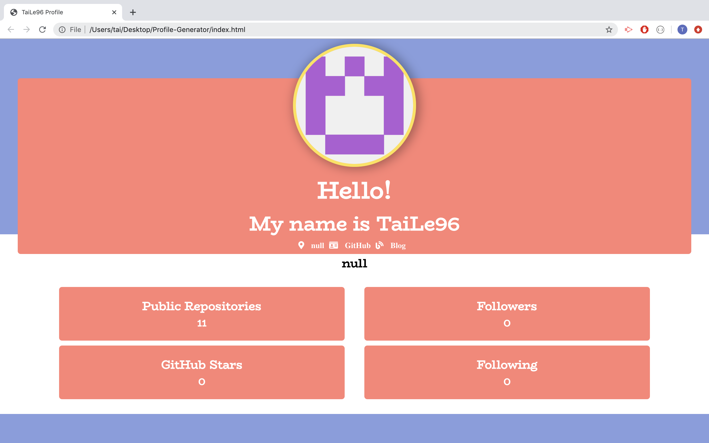

# portfolio-gen

# Summary
    - This a profile generator. It collects all the data using GitHub API to show the number of repositories, followers, following and GitHub stars. 
    - It will convert index.html to PDF file automaticlly.

# Techonologoies Used
    - GitHub API: used to call back the data from github.
    - Node: to install all the requirements.
    - Git: to commit and push.
    - Puppeteer: used to convert html to PDF.
    - 

# Site Picture and PDF


# Code Snippet
```js
const puppeteer = require('puppeteer');

async function makePdf(username) {
  try {
    const browser = await puppeteer.launch();
    const page = await browser.newPage();
    await page.goto(
      'file:////Users/tai/Desktop/Profile-Generator/index.html'
    );
    await page.emulateMedia('screen');

    await page.pdf({
      path: `${username}.pdf`,
      format: 'Letter',
      printBackground: true,
      landscape: true
    });

    console.log('Convert completed!!!');
    await browser.close();
  } catch (error) {
    console.log('Something is wrong!');
  }
}
```
Those codes were used to convert index.html to PDF file

# Code Snippet
```js
.then(function({ username, color }) {
      const config = { headers: { accept: 'application/json' } };
      let queryUrl = ` https://api.github.com/users/${username}`;
      return axios.get(queryUrl, config).then(userData => {
        let newUrl = `https://api.github.com/users/${username}/starred`;

        axios.get(newUrl, config).then(starredRepos => {
          data = {
            img: userData.data.avatar_url,
            location: userData.data.location,
            gitProfile: userData.data.html_url,
            userBlog: userData.data.blog,
            userBio: userData.data.bio,
            repoNum: userData.data.public_repos,
            followers: userData.data.followers,
            following: userData.data.following,
            starNum: starredRepos.data.length,
            username: username,
            color: color
          };
          generateHTML(data);
          writeHTML(generateHTML(data));
          makePdf(username);
        });
      });
    });
}
```
To get all the data from GitHub and write them to index.html.

# Author Links
[LinkedIn](www.linkedin.com/in/tu-tai-le-2a9646139)
[GitHub](https://github.com/TaiLe96)